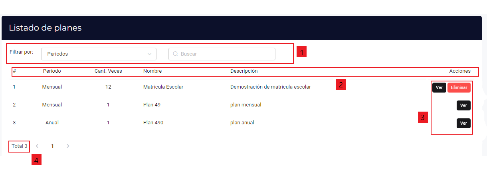

# Planes

### Investigación sobre cómo debería funcionar el módulo:

En el modulo de Planes, se debe de mostrar el periodo, cantidad de veces, 
nombre y descripcion de los mismos

### ERRORES Y SUGERENCIAS

- **Errores**

1. La barra de filtros y la de busqueda estan muy juntas con las de las listas 
de los planes y puede confundir al usuario
2. Las etiquetas del cuadro de la lista no estan resaltadas dificultando su vision 
3. Solo aparece el boton eliminar en la primera opcion y no en las demas 
4. La indicacion de del total de peticiones debe de ser mas grande

- **Sugerencias**

1. Separar la barra de los filtros y de busqueda mas de la lista
2. Las etiquetas del cuadro deben de ser mas grande y estar en "negrita"
3. Corregir el error del porque no aparece el boton de eliminar en el ressto
de las listas
4. Agrandamos el indicador del total de las peticiones de las islas